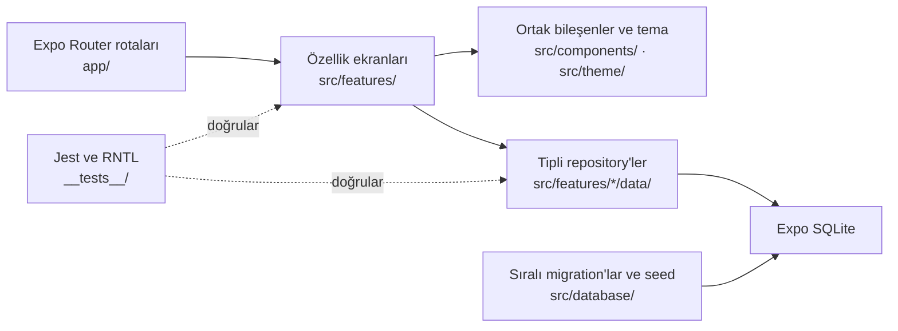

# TitanLog

TitanLog; antrenman programını, aktif set takibini, vücut ölçümlerini ve geçmiş karşılaştırmalarını cihaz üzerinde saklayan Android öncelikli, çevrimdışı çalışan bir fitness takip uygulamasıdır.

Proje aktif alfa geliştirme aşamasındadır. Son yayımlanan ön sürüm `v0.1.0-alpha.8`, güncel yerel geliştirme sürümü ise Sprint 8 için hazırlanan `0.1.0-alpha.9`'dur. Arayüz, düşük parlamalı grafit yüzeyleri ve ölçülü bakır vurguları birleştiren **Titan Iron** tasarım kimliğini kullanır.

[](https://docs.expo.dev/versions/v54.0.0/)
[](https://reactnative.dev/)
[](https://www.typescriptlang.org/)
[](LICENSE)
[](#sürümleme)

## Arayüz kimliği

Titan Iron; grafit yüzeyler, bakır odak rengi, kontrollü kontrast ve sıkı yerleşimlerle uzun kullanımda gözü yormayan bir mobil deneyim hedefler. Ortak tasarım token'ları ve yeniden kullanılabilir bileşenler, ekranlar arasındaki durum, boşluk ve erişilebilirlik davranışını tutarlı tutar.

## Temel özellikler

### Antrenman takibi

- Çevrimdışı aktif antrenman oturumları
- Egzersiz, set, tekrar ve ağırlığı tek satırda gösteren kompakt tablo
- Set tamamlama, oturum bitirme ve güvenli iptal akışları
- Uygulama yeniden açıldığında aktif oturumu geri yükleme
- Egzersiz ve oturum toplamları için tekrar, set, süre ve hacim hesapları
- Aktif sette son tamamlanan performansı kesintisiz gösterme
- Önceki tamamlanmış kayda göre ağırlık, tekrar ve oturum hacmi rekoru bildirimi

### Program yönetimi

- Antrenman günlerini ve haftalık planı düzenleme
- Bir güne bir veya daha fazla hafta günü atama
- Egzersiz varsayılanlarını değiştirme
- Katalogdan egzersiz ekleme veya özel egzersiz oluşturma
- Egzersizleri yeniden sıralama ve program ilişkisini kaldırma
- Program değişikliklerini yalnız gelecekteki oturumlara uygulama

### Antrenman geçmişi

- Tamamlanan oturumları en yeniden eskiye listeleme
- Salt okunur oturum, egzersiz ve set snapshot'ları
- Süre, tamamlanan set, tekrar ve hacim özetleri
- Aynı program günündeki önceki tamamlanmış antrenmanla karşılaştırma
- Egzersiz bazında en yeni kayıttan eskiye tamamlanmış performans geçmişi
- En yüksek ağırlık, tekrar ve oturum hacmi ile son performans özeti
- Aktif antrenman, program, gün ve tamamlanmış oturum ekranlarından egzersiz geçmişine erişim

### Vücut takibi

- Yerel vücut profili ve hedef kilo
- Kilo ile isteğe bağlı çevre ölçümlerini kaydetme
- Ölçüm ekleme, düzenleme ve korumalı silme
- Güncel durum, toplam değişim ve hedef ilerlemesi
- Yeni ölçümde en son kalıcı kiloyu başlangıç değeri olarak kullanma

### Ağırlık seçim çarkları

- Bisiklet kilidi benzeri dikey ve kademeli seçim
- Vücut kilosunda tam sayı ve tek ondalık basamak
- Egzersiz ağırlığında `2,5 kg` adımlar
- Adıma uymayan mevcut egzersiz değerlerini kaybetmeden koruma
- Virgül veya nokta kabul eden kesin elle giriş
- Erişilebilir artırma ve azaltma eylemleri

## Ekranlar ve rotalar

Expo Router'daki parantezli gruplar URL'nin parçası değildir. Aşağıdaki tablo önemli uygulama rotalarını özetler.

| Rota                                     | Amaç                                              |
| ---------------------------------------- | ------------------------------------------------- |
| `/`                                      | Ana ekran, günün antrenmanı ve son durum özetleri |
| `/workout`                               | Antrenman alanı ve aktif program günü             |
| `/workout/session/[sessionId]`           | Aktif antrenman ve set girişi                     |
| `/workout/session/[sessionId]/summary`   | Tamamlanan oturum özeti                           |
| `/workout/history`                       | Tamamlanmış antrenman geçmişi                     |
| `/workout/history/[sessionId]`           | Salt okunur antrenman detayı                      |
| `/workout/exercise/[exerciseId]/history` | Salt okunur egzersiz performans geçmişi           |
| `/workout/program`                       | Program yönetimi                                  |
| `/workout/program/day/[dayId]`           | Program günü ve egzersiz düzenleme                |
| `/progress`                              | Vücut ilerlemesi ve ölçüm geçmişi                 |
| `/progress/add`                          | Yeni vücut ölçümü                                 |
| `/progress/measurement/[measurementId]`  | Mevcut ölçümü düzenleme                           |
| `/progress/settings`                     | Başlangıç ve hedef kilo ayarları                  |
| `/profile`                               | Yerel profil ve uygulama bilgileri                |

`/auth/sign-in` ve `/auth/sign-up` rotaları yalnız arayüz hazırlığıdır; mevcut yerel işlevler hesap gerektirmez.

## Teknoloji yığını

| Teknoloji                    | Sürüm / rol                          |
| ---------------------------- | ------------------------------------ |
| React                        | `19.1.0`                             |
| React Native                 | `0.81.5`                             |
| Expo                         | SDK `54` (`~54.0.35`)                |
| Expo Router                  | `~6.0.24`, dosya tabanlı yönlendirme |
| Expo SQLite                  | `~16.0.10`, yerel kalıcılık          |
| TypeScript                   | `~5.9.2`, sıkı statik kontrol        |
| Jest                         | `~29.7.0`, otomatik testler          |
| React Native Testing Library | `^14.0.1`, etkileşim testleri        |
| ESLint / Prettier            | Kod kalitesi ve biçim tutarlılığı    |

## Mimari

Rota dosyaları ince sarmalayıcılar olarak özellik ekranlarını açar. İş kuralları ve veri erişimi özellik modüllerinde; SQLite kurulumu, migration'lar ve seed işlemleri ortak veritabanı katmanında tutulur.



Başlıca yapı taşları:

- Expo Router rota sarmalayıcıları
- Özellik tabanlı ekran, domain, veri ve yardımcı modülleri
- Tipli repository arayüzleri ve SQLite sorguları
- Sıralı, `PRAGMA user_version` tabanlı migration sistemi
- Ortak Titan Iron tasarım token'ları ve bileşenleri
- Repository, ekran ve etkileşim odaklı testler

## Veri ve gizlilik

- Veriler uygulamanın yerel SQLite veritabanında tutulur.
- Mevcut sürümde bulut eşitlemesi veya bulut yedeği yoktur.
- Yerel antrenman ve vücut takibi için hesap gerekmez.
- Uygulamayı kaldırmak veya uygulama verilerini temizlemek yerel kayıtları silebilir.
- Depoya kişisel veritabanı dosyaları dahil edilmez.

Bu yaklaşım ağ bağlantısı olmadan çalışmayı sağlar; tek başına şifreleme, yedekleme veya mutlak veri güvenliği garantisi vermez.

## Kurulum ve geliştirme

### Gereksinimler

- Node.js `20.19.0` veya üzeri
- npm
- Android geliştirme akışı için Expo SDK 54 ile uyumlu Expo Go

```bash
git clone https://github.com/ilhanki/TitanLog.git
cd TitanLog
npm ci
npx expo start
```

Metro'nun gösterdiği QR kodu Android cihazdaki Expo Go ile tarayın. Ağ erişimini kapatarak yerel başlangıcı sınamak için:

```bash
npx expo start --offline
```

Web hedefi statik dışa aktarılabilir; ancak Expo SQLite'ın web kalıcılığı projenin birincil desteklenen veri ortamı değildir. Veri güvenliği ve fiziksel etkileşim kontrolleri Android üzerinde yapılır.

## Kullanılabilir komutlar

| Komut                  | Amaç                                               |
| ---------------------- | -------------------------------------------------- |
| `npm start`            | Expo geliştirme sunucusunu başlatır.               |
| `npm run android`      | Metro'yu Android hedefiyle başlatır.               |
| `npm run ios`          | Metro'yu iOS hedefiyle başlatır.                   |
| `npm run web`          | Metro'yu web hedefiyle başlatır.                   |
| `npm run typecheck`    | TypeScript tip kontrolünü çalıştırır.              |
| `npm run lint`         | `app/` ve `src/` kaynaklarını ESLint ile denetler. |
| `npm run format`       | Desteklenen dosyaları Prettier ile biçimlendirir.  |
| `npm run format:check` | Biçimi dosya değiştirmeden denetler.               |
| `npm test`             | Jest test paketini tek süreçte çalıştırır.         |

## Doğrulama

Yayımlama hazırlığından önce aşağıdaki kontroller çalıştırılır:

```bash
npm run typecheck
npm run lint
npm run format:check
npm test -- --runInBand
npx expo-doctor
```

Mevcut test paketi repository ve SQLite davranışlarını, migration ve seed akışlarını, ekran etkileşimlerini, program düzenlemeyi, antrenman geçmişini, Titan Iron temasını ve ağırlık seçim çarklarını kapsar. Fiziksel cihaz testi otomatik kontrollerin yerine geçmez; ikisi birlikte kullanılır.

## Veritabanı ve migration'lar

- Güncel şema sürümü `3`'tür.
- Migration'lar sürüm sırasıyla ve işlem içinde uygulanır.
- Migration 1–3 yayımlanmış şema geçmişidir ve geriye dönük olarak düzenlenmemelidir.
- Tamamlanan antrenmanlar, sonradan değişen programdan bağımsız salt okunur snapshot'lar saklar.
- Oturum egzersizi snapshot'ları kalıcı egzersiz kimliğini korur; böylece yeniden adlandırma geçmiş bağlantısını bozmaz.
- Önceki performans ve rekor sorguları yalnız tamamlanmış, aktif oturumdan daha eski kayıtları kullanır.
- Program değişiklikleri geçmiş oturumları değiştirmez; gelecekte başlatılan oturumları etkiler.
- Kilo ve ölçüm değerleri SQLite'ta sayısal olarak saklanır; Türkçe ondalık gösterim arayüz katmanında uygulanır.

## Proje yapısı

```text
TitanLog/
├── app/                         # Expo Router rota sarmalayıcıları
│   ├── (tabs)/                  # Ana, antrenman, gelişim ve profil sekmeleri
│   ├── auth/                    # UI-only hesap ekranları
│   ├── progress/                # Ölçüm ve hedef rotaları
│   └── workout/                 # Oturum, geçmiş ve program rotaları
├── src/
│   ├── components/              # Ortak arayüz bileşenleri
│   ├── constants/               # Merkezi Türkçe metinler
│   ├── database/                # Migration, seed ve veritabanı kurulumu
│   ├── features/                # Body, home, progress ve workouts modülleri
│   └── theme/                   # Titan Iron tasarım token'ları
├── __tests__/                   # Repository, ekran ve davranış testleri
├── assets/                      # Uygulama görsel varlıkları
├── app.json                     # Expo yapılandırması
├── metro.config.js              # Metro ve SQLite web asset ayarları
└── package.json                 # Komutlar ve bağımlılıklar
```

## Sürümleme

TitanLog, [Semantic Versioning](https://semver.org/lang/tr/) ön sürüm modelini kullanır. Yayımlanan kilometre taşları mevcut HEAD üzerinde açıklamalı Git tag'leriyle işaretlenir ve fiziksel cihaz doğrulamasından sonra yayımlanır.

- Yerel paket hazırlığı: `0.1.0-alpha.9`
- Son yayımlanan tag: `v0.1.0-alpha.8`
- Planlanan sonraki tag: `v0.1.0-alpha.9`
- Expo uygulama sürümü: `0.1.0`
- Android `versionCode`: `1`
- iOS `buildNumber`: `1`

`v0.1.0-alpha.9` henüz oluşturulmamış veya origin'e gönderilmemiştir. Sprint 8 egzersiz geçmişi, önceki performans ve kişisel rekor deneyimi Samsung Galaxy A55 üzerinde fiziksel doğrulama beklemektedir.

## Yol haritası

- [x] Çevrimdışı antrenman ve aktif oturum takibi
- [x] Vücut profili, hedef ve ölçüm geçmişi
- [x] Tamamlanmış antrenman geçmişi ve karşılaştırma
- [x] Egzersiz geçmişi, önceki performans ve kişisel rekorlar
- [x] Antrenman programı yönetimi
- [x] Titan Iron görsel sistemi
- [x] Vücut ve egzersiz ağırlığı seçim çarkları
- [ ] Birden fazla antrenman programı
- [ ] Kullanıcı kontrollü veri dışa aktarma
- [ ] Bulut eşitlemesi ve yedekleme
- [ ] Sağlık platformu entegrasyonları
- [ ] Üretim mağazası derlemesi ve dağıtımı

Tarihler ve teslim kapsamları fiziksel doğrulama sonuçlarına göre belirlenir.

## Bilinen sınırlamalar

- Geliştirme ve fiziksel test önceliği Android'dir.
- Uygulama erken alfa aşamasında ve Expo Go tabanlı geliştirme akışındadır.
- Bulut yedeği veya cihazlar arası eşitleme yoktur.
- Google Play üzerinde üretim sürümü yayımlanmamıştır.
- Sprint 8 egzersiz geçmişi, önceki performans ve rekor geri bildirimi Samsung Galaxy A55 üzerinde henüz doğrulanmamıştır.
- Expo SQLite web kalıcılığı birincil desteklenen kullanım ortamı değildir.
- Hesap ekranları arayüz hazırlığıdır; kimlik doğrulama altyapısı uygulanmamıştır.

## Katkıda bulunma

Katkılar için önce kapsamı açıklayan bir issue açın; özellikle büyük özellikleri uygulamadan önce yaklaşımı netleştirin.

- Değişiklikleri küçük ve odaklı tutun.
- İngilizce [Conventional Commits](https://www.conventionalcommits.org/en/v1.0.0/) mesajları kullanın.
- Typecheck, lint, format ve test kontrollerini çalıştırın.
- Secret, kişisel veri, yerel veritabanı veya makineye özgü yol eklemeyin.
- Yayımlanmış migration dosyalarını değiştirmeyin; yeni şema ihtiyacı için yeni migration ekleyin.

## Lisans

TitanLog, [MIT Lisansı](LICENSE) kapsamında yayımlanır.
