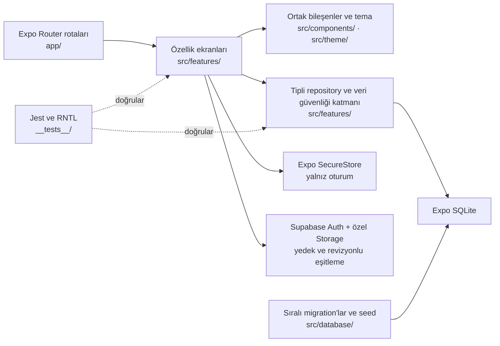

# TitanLog

TitanLog; antrenman programını, aktif set takibini, vücut ölçümlerini ve geçmiş karşılaştırmalarını cihaz üzerinde saklayan Android öncelikli, çevrimdışı çalışan bir fitness takip uygulamasıdır.

Proje aktif alfa geliştirme aşamasındadır. Son yayımlanan ön sürüm `v0.1.0-alpha.9`, güncel yerel geliştirme sürümü ise Sprint 13 için hazırlanan `0.1.0-alpha.12`'dir. Arayüz, düşük parlamalı grafit yüzeyleri ve ölçülü bakır vurguları birleştiren **Titan Iron** tasarım kimliğini kullanır.

[](https://docs.expo.dev/versions/v54.0.0/)
[](https://reactnative.dev/)
[](https://www.typescriptlang.org/)
[](LICENSE)
[](#sürümleme)

## Arayüz kimliği

Titan Iron; grafit yüzeyler, bakır odak rengi, kontrollü kontrast ve sıkı yerleşimlerle uzun kullanımda gözü yormayan bir mobil deneyim hedefler. Ortak tasarım token'ları ve yeniden kullanılabilir bileşenler, ekranlar arasındaki durum, boşluk ve erişilebilirlik davranışını tutarlı tutar.

## Sprint 13 geliştirme deneyimi

Güncel yerel geliştirme, kişisel profil başlığı, özel profil fotoğrafı, haftalık/aylık/yıllık içgörüler ve ayrı `Veri ve Yedekleme` merkezi sunar. Ana sekmeler `Ana Sayfa · Antrenman · Geçmiş · İlerleme · Hesabım` düzenindedir. Misafir kullanım zorunlu hesaba dönüştürülmemiştir.

Profil medyası fitness arşivlerine girmez; hesaplı kullanımda public olmayan, kullanıcıya özel Storage yolu kullanılır. Yedekleme ve cihaz eşitleme yalnız kullanıcının açık eylemiyle başlar. Hesap ve veri sahipliği birbirinden ayrı kalır.

Hesaplama kuralları, profil fotoğrafı gizliliği, Veri Merkezi farkları ve bilinen sınırlar için [`docs/profile-insights-data-center.md`](docs/profile-insights-data-center.md) belgesine bakın.

## Temel özellikler

### Antrenman takibi

- Çevrimdışı aktif antrenman oturumları
- Egzersiz, set, tekrar ve ağırlığı tek satırda gösteren kompakt tablo
- Set tamamlama, oturum bitirme ve güvenli iptal akışları
- Uygulama yeniden açıldığında aktif oturumu geri yükleme
- Egzersiz ve oturum toplamları için tekrar, set, süre ve hacim hesapları
- Her egzersiz için aradaki boş oturumları atlayarak en yakın geçerli tamamlanmış performansı gösterme
- Önceki tamamlanmış kayda göre ağırlık, tekrar ve oturum hacmi rekoru bildirimi

### Program yönetimi

- Antrenman günlerini ve haftalık planı düzenleme
- Bir güne bir veya daha fazla hafta günü atama
- Egzersizleri kompakt Titan Iron panellerinde yönetme
- Üst köşe tutamacına basılı tutup sürükleyerek egzersiz sırasını değiştirme
- TalkBack için görünür düğme kalabalığı oluşturmayan erişilebilir yukarı/aşağı taşıma eylemleri
- `Set | Tekrar | Kilo` düzenindeki kompakt pencereden egzersiz varsayılanlarını değiştirme
- Katalogdan egzersiz ekleme veya özel egzersiz oluşturma
- Egzersizleri program gününden güvenli biçimde kaldırma
- Program değişikliklerini yalnız gelecekteki oturumlara uygulama

### Antrenman geçmişi

- Tamamlanan oturumları en yeniden eskiye listeleme
- Salt okunur oturum, egzersiz ve set snapshot'ları
- Süre, tamamlanan set, tekrar ve hacim özetleri
- Aynı program günündeki önceki tamamlanmış antrenmanla karşılaştırma
- Egzersiz bazında en yeni kayıttan eskiye tamamlanmış performans geçmişi
- En yüksek ağırlık, tekrar ve oturum hacmi ile son performans özeti
- Aktif antrenman, program, gün ve tamamlanmış oturum ekranlarından egzersiz geçmişine erişim

Egzersiz rekorları yalnız geçerli ve tamamlanmış setlerden hesaplanır; eşit değer yeni rekor sayılmaz ve ilk ulaşılan kayıt tarihi korunur. Hacim hesabı `ağırlık × tekrar` toplamıdır. “Her el” egzersizlerinde girilen ağırlık geriye dönük olarak ikiye katlanmaz. Geçmiş ve rekorlar mevcut kayıtlardan salt okunur olarak türetilir; ayrı bir başarı kaydı oluşturulmaz.

### Vücut takibi

- Yerel vücut profili ve hedef kilo
- Başlangıç, güncel ve hedef kiloyu birlikte gösteren kompakt Gelişim paneli
- Kilo verme ve kilo alma hedeflerinde güvenli biçimde sınırlandırılan ilerleme rayı
- Toplam değişim, hedefe kalan, son ölçüm ve ölçüm sayısı özetleri
- Kilo ile isteğe bağlı çevre ölçümlerini kaydetme
- En güncel kaydı önce gösteren kompakt, sayfalı ölçüm geçmişi
- Son kalıcı kilodan açılan modal Yeni Ölçüm akışı
- Güncel kiloyu değiştirmeden yalnız hedef alanını güncelleyen Hedefi Düzenle modalı
- Ölçüm ekleme, düzenleme ve korumalı silme
- Güncel durum, toplam değişim ve hedef ilerlemesi
- Yeni ölçümde en son kalıcı kiloyu başlangıç değeri olarak kullanma

### Ana sayfa

- Aktif antrenman, bugünün planı, plansız gün ve kurulmamış program durumları için açık öncelik
- Duruma göre tek baskın `Antrenmana Devam Et` veya `Antrenmanı Başlat` eylemi
- Gerçek yerel vücut verilerinden türetilen kompakt gelişim özeti
- En son tamamlanan antrenmana doğrudan erişim
- Bir özet bölümü yüklenemediğinde diğer kullanılabilir eylemleri koruyan kısmi hata davranışı

### Sayısal seçim kontrolleri

- Vücut kilosunda modal, iki sütunlu tam sayı ve ondalık seçim çarkı
- Kompakt egzersiz tekrar ve ağırlık hücrelerinin tamamında doğrudan aşağı kaydırarak artırma, yukarı kaydırarak azaltma
- Aynı hücreye dokunarak ek panel açmadan klavyeyle doğrudan giriş
- Kaydırma sırasında yalnız etkin sayısal alanın dokunuşu sahiplenmesi; alan dışında normal liste kaydırmasının korunması
- Egzersiz ağırlığında `2,5 kg`, tekrarda `1` birimlik hareketler
- Adıma uymayan mevcut egzersiz değerlerini kaybetmeden koruma
- Virgül veya nokta kabul eden kesin elle giriş
- Erişilebilir artırma ve azaltma eylemleri

### Hesap ve veri güvenliği

- Hesap gerektirmeyen, çevrimdışı ve misafir öncelikli temel kullanım
- Bütün yerel program, egzersiz, oturum, set, profil ve ölçüm ilişkilerini içeren sürümlü `.titanlog` yedeği
- İçe aktarma öncesinde biçim, boyut, değer ve referans bütünlüğü doğrulaması
- Mevcut yerel verinin tamamını tek transaction içinde değiştiren, birleştirme yapmayan geri yükleme
- İsteğe bağlı Supabase e-posta/şifre hesabı ve SecureStore tabanlı kalıcı mobil oturum
- Kullanıcının açık eylemiyle çalışan, manuel bulut yedeğinden ayrı revizyonlu cihaz eşitleme akışı
- Değişmez tam veri kümesi snapshot'ları, deterministik SHA-256 özeti ve eski cihaz yazmalarını engelleyen compare-and-swap uzak başlık
- Yerel ve bulut verisi birlikte değiştiğinde sessiz kazanan seçmek yerine açık çatışma çözümü
- Yıkıcı bulut indirmesinden önce uygulamaya özel konumda tek bir yerel kurtarma arşivi
- Bir yerel veri kümesi için misafir veya açıkça onaylanmış tek hesap sahipliği
- Hesap uyuşmazlığında başka hesaba ait veriyi sessizce gösterme ya da yüklemeyi engelleyen koruma

## Ekranlar ve rotalar

Expo Router'daki parantezli gruplar URL'nin parçası değildir. Aşağıdaki tablo önemli uygulama rotalarını özetler.

| Rota                                     | Amaç                                              |
| ---------------------------------------- | ------------------------------------------------- |
| `/`                                      | Ana ekran, günün antrenmanı ve son durum özetleri |
| `/workout`                               | Antrenman alanı ve aktif program günü             |
| `/workout/session/[sessionId]`           | Aktif antrenman ve set girişi                     |
| `/workout/session/[sessionId]/summary`   | Tamamlanan oturum özeti                           |
| `/workout/history`                       | Tamamlanmış antrenman geçmişi                     |
| `/workout/history/[sessionId]`           | Salt okunur detay ve onaylı geçmiş kaydı silme    |
| `/workout/exercise/[exerciseId]/history` | Salt okunur egzersiz performans geçmişi           |
| `/workout/program`                       | Program yönetimi                                  |
| `/workout/program/day/[dayId]`           | Program günü ve egzersiz düzenleme                |
| `/progress`                              | Vücut ilerlemesi ve ölçüm geçmişi                 |
| `/progress/add`                          | Yeni vücut ölçümü                                 |
| `/progress/measurement/[measurementId]`  | Mevcut ölçümü düzenleme                           |
| `/progress/settings`                     | Başlangıç ve hedef kilo ayarları                  |
| `/profile`                               | Yerel profil ve uygulama bilgileri                |
| `/profile/data`                          | Hesap, yedekler ve manuel cihaz eşitleme yönetimi |
| `/auth/reset-password`                   | Doğrulanmış bağlantıyla şifre yenileme            |
| `/auth/callback`                         | E-posta doğrulama callback'ini güvenle tamamlama  |

`/auth/sign-in` ve `/auth/sign-up` isteğe bağlı hesap rotalarıdır. Supabase ortamı yapılandırılmadığında gerçek uzak başarı gösterilmez; yerel uygulama işlevleri ve yerel yedekleme kullanılmaya devam eder.

## Teknoloji yığını

| Teknoloji                    | Sürüm / rol                                       |
| ---------------------------- | ------------------------------------------------- |
| React                        | `19.1.0`                                          |
| React Native                 | `0.81.5`                                          |
| Expo                         | SDK `54` (`~54.0.35`)                             |
| Expo Router                  | `~6.0.24`, dosya tabanlı yönlendirme              |
| Expo SQLite                  | `~16.0.10`, yerel kalıcılık                       |
| Expo FileSystem / Sharing    | Yerel yedek, kurtarma kopyası ve paylaşım         |
| Expo Crypto / Network        | SHA-256 içerik özeti ve çevrimdışı ağ kontrolü    |
| Expo SecureStore             | Mobil Supabase oturumunun güvenli saklanması      |
| Supabase JS                  | İsteğe bağlı hesap, özel yedek ve manuel eşitleme |
| TypeScript                   | `~5.9.2`, sıkı statik kontrol                     |
| Jest                         | `~29.7.0`, otomatik testler                       |
| React Native Testing Library | `^14.0.1`, etkileşim testleri                     |
| ESLint / Prettier            | Kod kalitesi ve biçim tutarlılığı                 |

## Mimari

Rota dosyaları ince sarmalayıcılar olarak özellik ekranlarını açar. İş kuralları ve veri erişimi özellik modüllerinde; SQLite kurulumu, migration'lar ve seed işlemleri ortak veritabanı katmanında tutulur.



Başlıca yapı taşları:

- Expo Router rota sarmalayıcıları
- Özellik tabanlı ekran, domain, veri ve yardımcı modülleri
- Tipli repository arayüzleri ve SQLite sorguları
- Sıralı, `PRAGMA user_version` tabanlı migration sistemi
- Ortak Titan Iron tasarım token'ları ve bileşenleri
- Repository, ekran ve etkileşim odaklı testler

## Veri ve gizlilik

- Antrenman ve vücut verileri varsayılan olarak cihazdaki SQLite veritabanında kalır; hesap zorunlu değildir.
- Yerel yedek yalnız kullanıcı açıkça başlattığında sistem paylaşım akışına verilir. TitanLog kendi geçici dosyasını işlem sonunda kaldırır.
- Geri yükleme birleştirme yapmaz; doğrulanmış yedek mevcut yerel veri kümesinin tamamının yerini alır ve hata halinde transaction geri alınır.
- Erişim ve yenileme token'ları SQLite'a, yedek dosyasına, loglara veya README'ye yazılmaz; mobilde Expo SecureStore kullanılır.
- Bulut yedeği canlı eşitleme değildir. Yalnız kullanıcı düğmeye bastığında, oturum açmış kullanıcının özel `<user-id>/latest.titanlog` nesnesi yüklenir veya indirilir.
- Cihaz eşitleme de yalnız kullanıcının açık eylemiyle çalışır; arka plan, realtime veya otomatik giriş eşitlemesi yapmaz. Her başarılı gönderim yeni ve değişmez bir revizyon üretir.
- İndirme, yerel veriyi değiştirmeden önce boyut, SHA-256, arşiv sürümü ve ilişki bütünlüğünü yeniden doğrular; sonra tek exclusive transaction kullanır.
- Eşitleme bookkeeping verisi fitness arşivine, içerik özetine veya kurtarma kopyasına girmez.
- Storage bucket'ları public değildir; RLS politikaları başka kullanıcıların nesne ve metadata erişimini engeller.
- Çıkış yapmak yerel antrenman verisini silmez. Uzak hesap silme sunucu tarafı Edge Function ve yakın tarihli oturum gerektirir.
- Depoya `.env`, token, kişisel yedek, SQLite dosyası, üretilmiş export veya makine yolu dahil edilmez.

Bu yaklaşım ağ bağlantısı olmadan çalışmayı sağlar; tek başına şifreleme, yedekleme veya mutlak veri güvenliği garantisi vermez.

## Kurulum ve geliştirme

### Gereksinimler

- Node.js `20.19.0` veya üzeri
- npm
- Android geliştirme akışı için Expo SDK 54 ile uyumlu Expo Go

```bash
git clone https://github.com/ilhanki/TitanLog.git
cd TitanLog
npm ci
npx expo start
```

Metro'nun gösterdiği QR kodu Android cihazdaki Expo Go ile tarayın. Ağ erişimini kapatarak yerel başlangıcı sınamak için:

```bash
npx expo start --offline
```

Web hedefi statik dışa aktarılabilir; ancak Expo SQLite'ın web kalıcılığı projenin birincil desteklenen veri ortamı değildir. Veri güvenliği ve fiziksel etkileşim kontrolleri Android üzerinde yapılır.

### İsteğe bağlı Supabase kurulumu

Yerel ve misafir kullanım için Supabase gerekmez. Hesap ve manuel özel bulut yedeğini gerçek ortamda kullanmak için `.env.example` dosyasındaki adları yerel `.env` dosyasında doldurun:

```dotenv
EXPO_PUBLIC_SUPABASE_URL=
EXPO_PUBLIC_SUPABASE_ANON_KEY=
```

Anon/publishable anahtar istemciye açık bir anahtardır ve yalnız RLS ile korunmuş işlemler için kullanılır. Service-role anahtarı uygulamaya konmaz. SQL sırası, özel bucket'lar, Edge Function'lar ve gerçek ortam kabul planı [`supabase/README.md`](supabase/README.md) ile [`docs/manual-device-sync.md`](docs/manual-device-sync.md) içinde açıklanır.

## Kullanılabilir komutlar

| Komut                  | Amaç                                               |
| ---------------------- | -------------------------------------------------- |
| `npm start`            | Expo geliştirme sunucusunu başlatır.               |
| `npm run android`      | Metro'yu Android hedefiyle başlatır.               |
| `npm run ios`          | Metro'yu iOS hedefiyle başlatır.                   |
| `npm run web`          | Metro'yu web hedefiyle başlatır.                   |
| `npm run typecheck`    | TypeScript tip kontrolünü çalıştırır.              |
| `npm run lint`         | `app/` ve `src/` kaynaklarını ESLint ile denetler. |
| `npm run format`       | Desteklenen dosyaları Prettier ile biçimlendirir.  |
| `npm run format:check` | Biçimi dosya değiştirmeden denetler.               |
| `npm test`             | Jest test paketini tek süreçte çalıştırır.         |

## Doğrulama

Yayımlama hazırlığından önce aşağıdaki kontroller çalıştırılır:

```bash
npm run typecheck
npm run lint
npm run format:check
npm test -- --runInBand
npx expo-doctor
```

Mevcut test paketi repository ve SQLite davranışlarının yanında deterministik arşiv hashing'ini, migration 4→5 geçişini, revizyon karar matrisini, eski yazma engelini, kurtarma arşivini, ilişki bütünlüğünü ve statik SQL/RLS güvenlik sınırlarını kapsar. Fiziksel cihaz ve gerçek Supabase testleri otomatik kontrollerin yerine geçmez; üçü birlikte kullanılır.

## Veritabanı ve migration'lar

- Güncel yerel SQLite şema sürümü `5`'tir. `.titanlog` veri şeması geriye uyumluluk için `4`, arşiv biçimi ise `1` olarak kalır.
- Migration'lar sürüm sırasıyla ve işlem içinde uygulanır.
- Migration 1–3 yayımlanmış şema geçmişidir ve geriye dönük olarak düzenlenmemelidir.
- Migration 4 mevcut verileri yeniden yazmadan kurulum kimliği, isteğe bağlı sahip hesap ve son yedek zamanlarını tek `dataset_metadata` satırında tutar.
- Migration 5 yalnız son kabul edilen uzak revizyon/özet, son eşitlenen yerel özet, başarılı eşitleme zamanı, güvenli sonuç kodu ve isteğe bağlı işlem kimliği tutan tekil `sync_state` kaydını ekler; fitness tablolarını yeniden yazmaz.
- Tamamlanan antrenmanlar, sonradan değişen programdan bağımsız salt okunur snapshot'lar saklar.
- Oturum egzersizi snapshot'ları kalıcı egzersiz kimliğini korur; böylece yeniden adlandırma geçmiş bağlantısını bozmaz.
- Önceki performans ve rekor sorguları yalnız tamamlanmış, aktif oturumdan daha eski kayıtları kullanır.
- Kalıcı kimliği bulunmayan eski bir snapshot yalnız Türkçe uyumlu, tam ve tekil ad eşleşmesiyle ilişkilendirilebilir; belirsiz eşleşmeler birleştirilmez ve arayüzde kayıt olarak sunulmaz.
- Program değişiklikleri geçmiş oturumları değiştirmez; gelecekte başlatılan oturumları etkiler.
- Kilo ve ölçüm değerleri SQLite'ta sayısal olarak saklanır; Türkçe ondalık gösterim arayüz katmanında uygulanır.
- Home ve Gelişim özetleri yalnız yerel kalıcı kayıtlardan türetilir; buluttan veya varsayımsal sağlık metriklerinden değer üretilmez.

## Proje yapısı

```text
TitanLog/
├── app/                         # Expo Router rota sarmalayıcıları
│   ├── (tabs)/                  # Ana, antrenman, gelişim ve profil sekmeleri
│   ├── auth/                    # İsteğe bağlı hesap ve şifre yenileme ekranları
│   ├── profile/                 # Hesap ve veri yönetimi rotası
│   ├── progress/                # Ölçüm ve hedef rotaları
│   └── workout/                 # Oturum, geçmiş ve program rotaları
├── src/
│   ├── components/              # Ortak arayüz bileşenleri
│   ├── constants/               # Merkezi Türkçe metinler
│   ├── database/                # Migration, seed ve veritabanı kurulumu
│   ├── features/                # Ürün, auth, data-safety ve sync modülleri
│   └── theme/                   # Titan Iron tasarım token'ları
├── __tests__/                   # Repository, ekran ve davranış testleri
├── assets/                      # Uygulama görsel varlıkları
├── supabase/                    # Özel bucket, RLS ve Edge Function kurulumu
├── app.json                     # Expo yapılandırması
├── metro.config.js              # Metro ve SQLite web asset ayarları
└── package.json                 # Komutlar ve bağımlılıklar
```

## Sürümleme

TitanLog, [Semantic Versioning](https://semver.org/lang/tr/) ön sürüm modelini kullanır. Yayımlanan kilometre taşları mevcut HEAD üzerinde açıklamalı Git tag'leriyle işaretlenir ve fiziksel cihaz doğrulamasından sonra yayımlanır.

- Yerel paket hazırlığı: `0.1.0-alpha.12`
- Son yayımlanan tag: `v0.1.0-alpha.9`
- Planlanan sonraki tag: `v0.1.0-alpha.12`
- Expo uygulama sürümü: `0.1.0`
- Android `versionCode`: `1`
- iOS `buildNumber`: `1`

`v0.1.0-alpha.10` ve `v0.1.0-alpha.11` oluşturulmamıştır. `v0.1.0-alpha.12` de bu yerel hazırlık sırasında oluşturulmamıştır. Yeni profil medyası migration'ı deploy edilmemiştir; yeni native medya modüllerini içeren development build ve Samsung Galaxy A55 kabul testi beklemektedir.

## Yol haritası

- [x] Çevrimdışı antrenman ve aktif oturum takibi
- [x] Vücut profili, hedef ve ölçüm geçmişi
- [x] Tamamlanmış antrenman geçmişi ve karşılaştırma
- [x] Egzersiz geçmişi, önceki performans ve kişisel rekorlar
- [x] Kompakt panel ve erişilebilir sürükle-bırak sıralama ile antrenman programı yönetimi
- [x] Titan Iron görsel sistemi
- [x] Vücut ağırlığı seçim çarkı ve satır içi egzersiz sayısal kontrolleri
- [ ] Birden fazla antrenman programı
- [x] Kullanıcı kontrollü sürümlü yerel yedek ve replace-only geri yükleme
- [x] İsteğe bağlı hesap ve manuel özel bulut yedeği temeli
- [x] Güvenli manuel, revizyonlu tam veri kümesi eşitleme temeli
- [ ] Gerçek Supabase ve iki cihaz kabul doğrulaması
- [ ] PT–sporcu ilişki temeli
- [ ] Sağlık platformu entegrasyonları
- [ ] Üretim mağazası derlemesi ve dağıtımı

Tarihler ve teslim kapsamları fiziksel doğrulama sonuçlarına göre belirlenir.

## Bilinen sınırlamalar

- Geliştirme ve fiziksel test önceliği Android'dir.
- Uygulama erken alfa aşamasında ve Expo Go tabanlı geliştirme akışındadır.
- Otomatik, arka plan, realtime veya kayıt bazlı merge eşitlemesi yoktur; eşitleme tam veri kümesi snapshot'ı ve açık kullanıcı onayı kullanır.
- Google Play üzerinde üretim sürümü yayımlanmamıştır.
- Sprint 10–11 cihaz eşitleme akışları Samsung Galaxy A55 ve gerçek Supabase üzerinde henüz doğrulanmamıştır.
- Egzersiz geçmişinde grafik veya otomatik ağırlık/antrenman önerisi yoktur; kayıtlar yalnız geçmiş performansı açıklar.
- Expo SQLite web kalıcılığı birincil desteklenen kullanım ortamı değildir.
- Supabase kimlik bilgileri, SQL migration'ları ve Edge Function'lar deploy edilmeden gerçek uzak hesap, bulut yedeği, cihaz eşitleme, RLS izolasyonu ve hesap silme doğrulanamaz.

## Katkıda bulunma

Katkılar için önce kapsamı açıklayan bir issue açın; özellikle büyük özellikleri uygulamadan önce yaklaşımı netleştirin.

- Değişiklikleri küçük ve odaklı tutun.
- İngilizce [Conventional Commits](https://www.conventionalcommits.org/en/v1.0.0/) mesajları kullanın.
- Typecheck, lint, format ve test kontrollerini çalıştırın.
- Secret, kişisel veri, yerel veritabanı veya makineye özgü yol eklemeyin.
- Yayımlanmış migration dosyalarını değiştirmeyin; yeni şema ihtiyacı için yeni migration ekleyin.

## Lisans

TitanLog, [MIT Lisansı](LICENSE) kapsamında yayımlanır.
